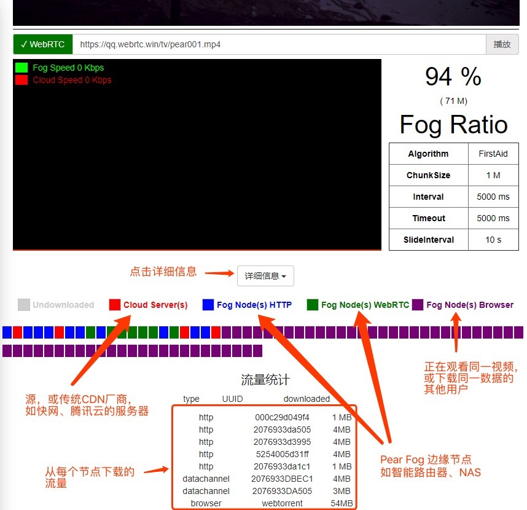

<h1 align="center">
  </img>
  <br>
  PearPlayer.js
  <br>
  <br>
</h1>

<h4 align="center">一个支持多协议、多源、混合P2P-CDN的流媒体播放器</h4>
<br>

**[PearPlayer（梨享播放器）](https://github.com/PearInc/PearPlayer.js)** 是完全用JavaScript写的开源HTML5流媒体播放框架，实现了融合HTTP（包含HTTPS、HTTP2）、WebRTC的多协议、多源、低延迟、高带宽利用率的无插件Web端流媒体加速能力。基于H5的MSE技术(Media Source Extension)将来自多个源节点的Buffer分块喂给播放器，再加上精心设计的算法来达到最优的调度策略及对各种异常情况的处理，Pear Player能在保证用户流畅视频体验的前提下最大化P2P率。


<br>
<br>


只需将`pear-player.min.js`通过`<script>`标签导入到HTML就可以使用。 参考以下[代码示例](#使用方法)，也可以查看[`/examples/test.html`](/examples/test.html)来了解使用方法。

信令部分以及WebRTC部分使用了精心设计的协议，实现此部分可以参考[API文档](docs/get-started.md)。<br/>

### 特性

- P2P能力基于**WebRTC**，无须安装任何插件
- **播放流畅，加载快速**，严格测试，稳定可靠
- 多协议(HTTP、HTTPS、WebRTC)、多源
- 自行研发的调度算法，在保证用户流畅视频体验的前提下最大化P2P率
- 默认无需填参数（内部根据视频码率等作自适应），高级使用模式可自行调整算法和参数
- 默认不会无限制缓冲，尽可能为CP用户节省带宽/流量
- 支持Chrome、Firefox、Opera、Safari11等主流浏览器，不久将支持腾讯微信、X5/TBS
- 可选接入低成本、高可用性的Pear [FogVDN](https://github.com/PearInc/FogVDN)
- 协议默认通过TLS/DTLS全加密，无DPI特征；并可通过Pear Fog组件的动态端口映射进一步消除统计学特征
- 像使用HTML5 `<video>`标签一样简单，并容易与[video.js](https://github.com/videojs/video.js)等流行播放框架集成
- 目前已实现Browser P2P能力（基于webtorrent）
<br>
Demo演示地址：https://qq.webrtc.win/watch



## 使用方法

### 导入js文件并绑定video标签
首先通过script标签导入pear-player.min.js：
```html
<script src="./dist/pear-player.min.js"></script>
```
或者使用CDN：
```html
<script src="https://cdn.jsdelivr.net/npm/pearplayer@latest/dist/pear-player.min.js"></script>
```
假设用video标签播放（/tv/pear001.mp4）这个视频，HTML如下所示：
```html
<video id="pearvideo" src="https://qq.webrtc.win/tv/pear001.mp4" controls>
```
只需要如下几行代码，即可将PearPlayer绑定到video标签：
```html
<script>
/**
 * 第一个参数为video标签的id或class
 * opts是可选的参数配置
 */
var player = new PearPlayer('#pearvideo', opts);
</script>
```
恭喜您，您的播放器已经具备P2P能力了，而且无须任何插件！

### 同其他播放框架集成：
本播放器现已支持video.js，示例代码请移步[videojs.html](examples/videojs/videojs.html)

### 谁在用我们的产品？

+ [Pear Limited](https://pear.hk)
+ [Lenovo China](https://www.lenovo.com.cn/)
+ [Newifi xCloud](http://www.newifi.com/)
+ [UCloud](https://www.ucloud.cn)
+ [Tencent Cloud](https://qcloud.com)
+ [Tencent X5/TBS](https://x5.tencent.com/tbs/)

### Pear Player 文档
- **[阅读get-started文档](docs/get-started.md)**
- **[阅读API文档](docs/api.md)**

### 致谢
特别感谢以下项目，为本项目提供了部分灵感来源以及API设计参考：

- [WebTorrent](https://github.com/webtorrent/webtorrent)
- [Peer5](https://www.peer5.com/#)

### 演讲与媒体报道

- 2017.08.18  （IT大咖说） - [WebRTC会成主流吗？众包CDN时代到了！](http://mp.weixin.qq.com/s/cx_ljl2sexE0XkgliZfnmQ)
- 2017.07.11 （OSChina开源中国） - [PearPlayer.js —— 混合P2P-CDN的流媒体播放器](https://www.oschina.net/p/PearPlayerjs)
- 2017.06.24 （腾讯Web前端大会） - [基于WebRTC的P2P-CDN流媒体加速](http://www.itdks.com/dakashuo/new/dakalive/detail/2577)
- 2017.05.17 （南方科技大学） - Edge Computing and Shared Fog Streaming
- 2017.05.08 （台湾逢甲大学） - A Cooler Fruit Venture: Scaling up a Network from Cloud to Fog with Crowdsourcing
- 2016.08.17 （香港科技大学） - From Cloud to Fog: Scaling up a Network with Crowdsourcing

### License

MIT. Copyright (c) [Pear Limited](https://pear.hk) and [snowinszu](https://github.com/snowinszu).

### 帮助与支持
E-mail: <service@pear.hk>；用户QQ群：`373594967`；[CP/CDN接入、OEM与其他商务合作](https://github.com/PearInc/FogVDN)

ffmpeg  -i ./SoundOfMusic.mp4 -vcodec copy -acodec copy -ss 00:00:10 -t 00:20:00 ./SoundOfMusic_new.mp4 -y
