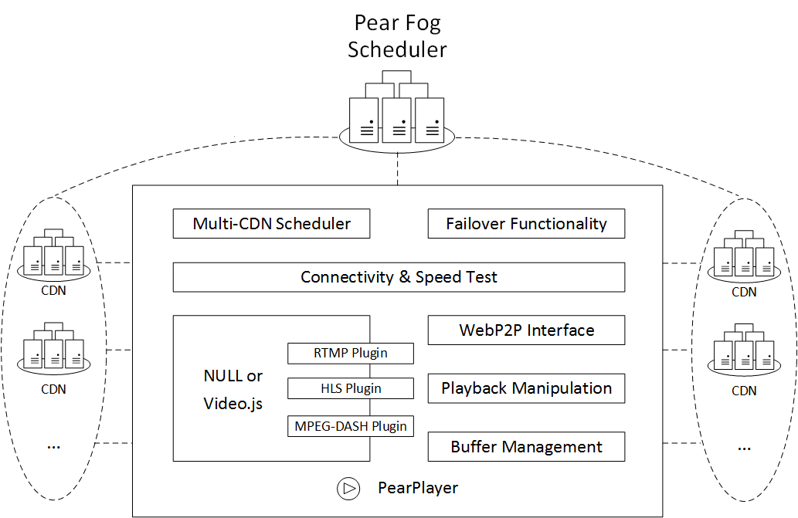
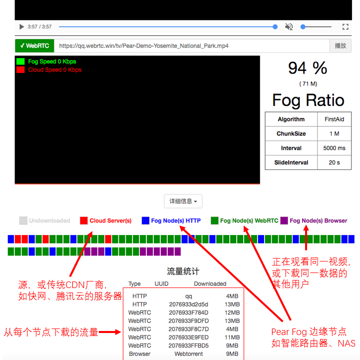

<h1 align="center">
  </img>
  <br>
  <a href="https://demo.webrtc.win/player">PearPlayer.js</a>
  <br>
  <br>
</h1>

<h4 align="center">一个支持多协议、多源和混合P2P-CDN的流媒体播放器</h4>
<p align="center">
  <a href="https://www.npmjs.com/package/pearplayer"></a>
   <a href="https://www.jsdelivr.com/package/npm/pearplayer"></a>
 <a href="https://www.jsdelivr.com/package/npm/pearplayer"></a>
</p>
<br>

**[English](https://github.com/PearInc/PearPlayer.js/blob/master/README_EN.md)**

PearPlayer（梨享播放器）**[[Demo](https://demo.webrtc.win/)]** 是完全用JavaScript写的开源HTML5流媒体播放框架，实现了融合HTTP（含HTTPS、HTTP2）和WebRTC的多协议、多源、低延迟、高带宽利用率的无插件Web客户端流媒体加速能力。基于H5的MSE（Media Source Extension）技术将来自多个源节点的Buffer分块喂给播放器，再加上精心设计的算法可实现最优的调度策略及对各种异常情况的处理，PearPlayer由此能在保证用户流畅视频体验的前提下最大化P2P率。


<br>
<br>


通过`<script>`标签将`pear-player.min.js`导入到HTML即可使用。参考以下[代码示例](#快速开始)，也可查看[`/examples/player-test.html`](/examples/player-test.html)或[get-started](docs/get-started.md)了解使用方法。<br/>


## 特性

- P2P能力基于**WebRTC**，无须安装任何插件
- 多协议(HTTP、HTTPS、WebRTC)、多源
- 自研的调度算法，在保证用户流畅视频体验的前提下最大化P2P率
- 默认无需填参数（内部根据视频码率等作自适应），高级使用模式下可自行调整算法和参数
- 默认不会无限制缓冲，尽可能为CP用户节省带宽/流量
- 支持Chrome、Firefox、Opera、IE、Edge等主流浏览器，即将支持Safari、腾讯微信、X5/TBS（可多源传输，播放问题待不久后由MSE支持完善）
- 可选接入低成本、高可用的Pear [Fog CDN](https://github.com/PearInc/FogVDN)
- 协议默认通过TLS/DTLS全加密，无DPI特征；并可通过Pear Fog组件的动态端口映射进一步消除统计学特征
- 像使用HTML5 `<video>`标签一样简单，并易与[video.js](https://github.com/videojs/video.js)等流行播放框架集成
- 具备Browser P2P能力（基于WebTorrent）



## 快速开始
将以下代码拷贝到HTML5代码中，打开网页，见证奇迹的时刻到了！
```html
<script src="https://cdn.jsdelivr.net/npm/pearplayer@latest"></script>
<video id="video" controls></video>
<script>
  var player = new PearPlayer('#video', { src: 'https://qq.webrtc.win/tv/Pear-Demo-Yosemite_National_Park.mp4' });
</script>
```

## 使用方法

### 导入js文件并绑定video标签
首先通过script标签导入pear-player.min.js：
```html
<script src="./dist/pear-player.min.js"></script>
```
或使用CDN：
```html
<script src="https://cdn.jsdelivr.net/npm/pearplayer@latest"></script>
```
假设用video标签播放以下视频，HTML如下：
```html
<video id="pearvideo" src="https://qq.webrtc.win/tv/Pear-Demo-Yosemite_National_Park.mp4" controls>
```
只需以下几行代码，即可将PearPlayer绑定到video标签：
```html
<script>
  /**
  * 第一个参数为video标签的id或class
  * opts是可选的参数配置
  */
  if (PearPlayer.isMSESupported()) {
    var player = new PearPlayer('#pearvideo', opts);
  }
</script>
```
恭喜您，您的播放器已经具备P2P能力了，而且无须任何插件！

### 如何为自己的视频加速？
示例中的视频是已经分发过的，那么如何为任意视频加速呢？很简单，只需在[视频分发系统](https://oss.webrtc.win/)中添加您的视频URL，即可利用Pear的海量节点为您的视频加速！具体教程请点击[这里](https://manual.webrtc.win/oss/)（目前新注册用户可以免费分发3个大小不超过100MB的MP4或TS格式的文件，视频名字需添加`Pear-Demo`前缀，如`Pear-Demo-movie.mp4`）

## 谁在使用我们的产品？

+ [Pear Limited](https://pear.hk)
+ [Lenovo China](https://www.lenovo.com.cn/)
+ [Newifi xCloud](http://www.newifi.com/)
+ [FastWeb](http://fastweb.com.cn/)
+ [UCloud](https://www.ucloud.cn)
+ [Tencent Cloud](https://qcloud.com)
+ [Tencent X5/TBS](https://x5.tencent.com/tbs/)
+ [Tencent APD](http://www.chinaz.com/news/2016/0707/548873.shtml)

## PearPlayer 文档
- **[阅读get-started文档](docs/get-started.md)**
- **[阅读API文档](docs/api.md)**

## 致谢
特别感谢以下项目，为本项目提供了部分灵感以及API设计参考：

- [WebTorrent](https://github.com/webtorrent/webtorrent)
- [Peer5](https://www.peer5.com/#)

## 演讲与媒体报道

- 2018.02.07 （36氪） - [「Pear梨享」让雾计算落地，百万边缘节点的背后是提高效率和成本控制](http://36kr.com/p/5118296.html) 
- 2017.11.24 （金色财经） - [谛听科技正式进军区块链领域，战略投资梨享计算](http://www.jinse.com/blockchain/99767.html)
- 2017.09.01 （未来网络开放社区联盟） - [继云计算之后，雾计算再起 —— 谈谈 P2P CDN](https://mp.weixin.qq.com/s/39dfSA6cTj2eoo-KqsC3AQ)  
- 2017.08.18 （IT大咖说） - [WebRTC会成主流吗？众包CDN时代到了！](http://mp.weixin.qq.com/s/cx_ljl2sexE0XkgliZfnmQ)
- 2017.07.11 （OSChina开源中国） - [PearPlayer.js —— 混合P2P-CDN的流媒体播放器](https://www.oschina.net/p/PearPlayerjs)
- 2017.06.24 （腾讯Web前端大会） - [基于WebRTC的P2P-CDN流媒体加速](http://www.itdks.com/dakalive/detail/2577)
- 2017.05.17 （南方科技大学） - Edge Computing and Shared Fog Streaming
- 2017.05.08 （台湾逢甲大学） - A Cooler Fruit Venture: Scaling up a Network from Cloud to Fog with Crowdsourcing
- 2016.08.17 （香港科技大学） - From Cloud to Fog: Scaling up a Network with Crowdsourcing

## License

MIT. Copyright (c) [Pear Limited](https://pear.hk) and [snowinszu](https://github.com/snowinszu).

## 帮助与支持
E-mail: <service@pear.hk>；用户QQ群：`373594967`；[CP/CDN接入、OEM与其他商务合作](https://github.com/PearInc/FogVDN)
