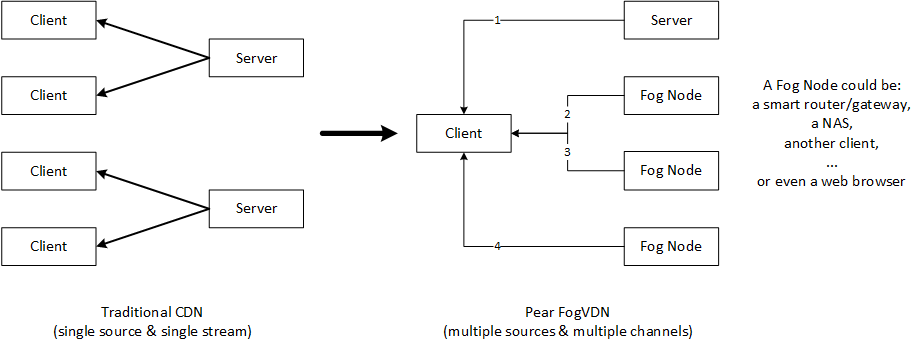

<h1 align="center">
  </img>
  <br>
  PearPlayer.js
  <br>
  <br>
</h1>

<h4 align="center">一个支持多协议，多源、混合P2P-CDN的流媒体播放器</h4>
<br>

**PearPlayer（梨享播放器）** 是完全用JavaScript写的开源HTML5流媒体播放框架，实现了融合HTTP（包含HTTPS、HTTP2）、WebRTC的多协议、多源、低延迟、高带宽利用率的无插件Web端流媒体加速能力。基于H5的MSE技术(Media Source Extension)将来自多个源节点的Buffer分块喂给播放器，再加上精心设计的算法来达到最优的调度策略及对各种异常情况的处理，Pear Player能在保证用户流畅视频体验的前提下最大化P2P率。



只需将`pear-player.min.js`通过`<script>`标签导入到HTML就可以使用。 参考以下[代码示例](#使用方法)，也可以查看[`/examples/test.html`](/examples/test.html)来了解使用方法。

信令部分以及WebRTC部分我们使用了自己精心设计的协议，实现此部分可以参考我们的API文档。

### 特性

- P2P能力基于**WebRTC**，无须安装任何插件
- **播放流畅，加载快速**
- 多协议(HTTP、HTTPS、WebRTC)、多源
- 自行研发的调度算法，在保证用户流畅视频体验的前提下最大化P2P率
- 经过严格测试，稳定可靠
- 支持Chrome、Firefox、Opera等主流浏览器
- 可选接入低成本、高可用性的Pear [FogVDN](https://github.com/PearInc/FogVDN)
- 像使用HTML5 `<video>`标签一样简单，并容易与[video.js](https://github.com/videojs/video.js)等流行播放框架集成

## 使用方法

### 导入js文件并绑定video标签
首先通过script标签导入pear-player.min.js：
```html
<script src="./dist/pear-player.min.js"></script>
```
或者使用CDN：
```html
<script src="https://cdn.jsdelivr.net/npm/pearplayer@latest/dist/pear-player.min.js"></script>
```
假设用video标签播放（/tv/pear001.mp4）这个视频，HTML如下所示：
```html
<video id="pearvideo" src="https://qq.webrtc.win/tv/pear001.mp4" controls>
```
只需要如下几行代码，即可将PearPlayer绑定到video标签：
```html
<script>
/**
 * 第一个参数为video标签的id或class
 * 第二个参数为获得授权后的token
 * opts是可选的参数配置
 */
var player = new PearPlayer('#pearvideo', token, opts);
</script>
```
恭喜您，您的播放器已经具备P2P能力了，而且无须任何插件！

### 获取token
在使用PearPlayer之前，需要获取token，通过调用我们提供的API接口（/v1/customer/login）并传入用户名和密码，
我们已经为访客提供了测试帐号（用户名：test　密码：123456），获取token的示例代码如下：
```js
var xhr = new XMLHttpRequest();
xhr.open("POST", 'https://api.webrtc.win:6601/v1/customer/login');
var data = JSON.stringify({
    user:'test',
    password:'123456'
});
xhr.onload = function () {
    if (this.status >= 200 && this.status < 300) {
        var res = JSON.parse(this.response);
        if (!!res.token){
            console.log('token:' +res.token);
        }
    } else {
        alert('请求出错!');
    }
};
xhr.send(data);
```

### 同其他播放框架集成：
本播放器现已支持video.js，示例代码请移步[videojs.html](examples/videojs/videojs.html)

### 谁在用我们的产品？

+ [Pear Limited](https://pear.hk)
+ [UCloud](https://www.ucloud.cn)
+ [Tencent Cloud](https://qcloud.com)
+ [Tencent X5/TBS](https://x5.tencent.com/tbs/)

### Pear Player 文档
- **[阅读get-started文档](docs/get-started.md)**
- **[阅读API文档](docs/api.md)**

### 致谢
特别感谢以下项目，为我们提供了技术参考以及灵感来源。

- [WebTorrent](https://github.com/webtorrent/webtorrent)
- [Peer5](https://www.peer5.com/#)

### 媒体报道

- June 2017 (腾讯Web前端大会) - [基于WebRTC的P2P-CDN流媒体加速](http://www.itdks.com/dakashuo/new/dakalive/detail/2577)

### License

MIT. Copyright (c) [Pear Limited](https://pear.hk) and [Xie Ting](https://github.com/snowinszu).

### 商务合作
CP/CDN接入、OEM与其他商务合作请联系：E-mail: service@pear.hk；QQ群：373594967
