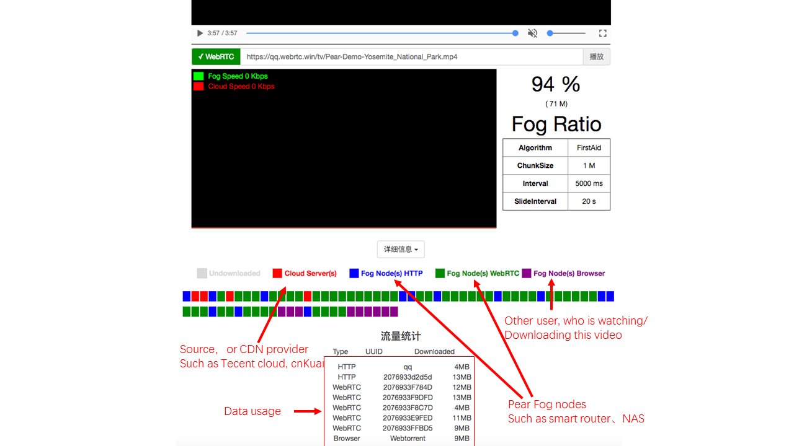

<h1 align="center">

</img>
  <br>
  <a href="https://demo.webrtc.win/player">PearPlayer.js</a>  <br>
  <br>
</h1>
<h4 align="center">A multi-protocol, multi-source and hybrid P2P-CDN streaming media player</h4>
<p align="center">
.  <a href="https://www.npmjs.com/package/pearplayer"></a>
   <a href="https://www.jsdelivr.com/package/npm/pearplayer"></a>
 <a href="https://www.jsdelivr.com/package/npm/pearplayer"></a>
</p>
<br>

**[English](https://github.com/PearInc/PearPlayer.js/blob/master/README_EN.md)**

PearPlayer (梨享播放器) **[[Demo](https://demo.webrtc.win/)]** is a streaming media player framework written completely with HTML5 and JavaScript. Combining HTTP (including HTTPS, HTTP2) and WebRTC, PearPlayer accelerates media streaming on the Web. It supports multiple protocols, multiple sources, and achieves low latency and high bandwidth utilization. With the help of H5 MSE (Media Source Extension) technology, it receives buffers from multiple source nodes and delivers to the player. Finely designed algorithms are adopted to achieve the best scheduling effect and to handle abnormal situations. Thus, PearPlayer can provide end-users with wonderful video watching experience while maximizing the P2P ratio at the same time.

<br>
<br>


Simply import `pear-player.min.js` to HTML via the `<script>` tag. Refer to [code examples](#quick-start) below, or consult [`/examples/player-test.html`](/examples/player-test.html) or [get-started](docs/get-started.md) for usages.<br/> 


## Features
- Plugin-free thanks to the P2P ability based on **WebRTC**
- Multi-protocol (HTTP, HTTPS, WebRTC) and multi-source
-	Customized algorithms that provide users with wonderful video watching experience while maximizing the P2P ratio at the same time.
-	Parameter-free by default (dynamic adaptive internally according to bitrate, etc.). Clients can fill in their preferred parameters in advanced mode.
-	Buffers are limited to save bandwidth/traffic for CP users.
-	Support Chrome, Firefox, Opera, IE, Edge and other mainstream browsers; will support Safari, Tencent WeChat and X5/TBS (multi-source transmission is enabled; media playback issues will be well resolved when MSE is supported)
-	Optional access to low cost, high availability Pear [Fog CDN](https://github.com/PearInc/FogCDN)
-	Fully encrypted via TLS/DTLS by default, no DPI features; statistical characteristics can be further eliminated using dynamic port mapping of Pear Fog Suite.
-	As easy as using HTML5 `<video>` tag; easy to integrate with popular player frameworks like [video.js](https://github.com/videojs/video.js)
- With Browser-to-Browser P2P ability (based on WebTorrent)



## Quick Start
Please copy the following codes into Web HTML5 code, and then open the webpage. Now, it's time to witness the miracle.

```html<script src="https://cdn.jsdelivr.net/npm/pearplayer@latest"></script>
<video id="video" controls></video>
<script>
  var player = new PearPlayer('#video', { src: 'https://qq.webrtc.win/tv/Pear-Demo-Yosemite_National_Park.mp4' });
</script>
```

## Usages
###  Import js file and bind to video tag
First import the <script> tag to pear-player.min.js:
```html
<script src="./dist/pear-player.min.js"></script>
```
or use CDN:
```html
<script src="https://cdn.jsdelivr.net/npm/pearplayer@latest"></script>
```
If use video tag to play the following video, HTML is like below:
```html
<video id="pearvideo" src="https://qq.webrtc.win/tv/Pear-Demo-Yosemite_National_Park.mp4" controls>
```
PearPlayer can be bound to the video tag using only the codes below:
```html
<script>
  /**
  * The first parameter is ID or CLASS of the video tag
  * Opts means the optional parameter configurations
  */
  if (PearPlayer.isMSESupported()) {
    var player = new PearPlayer('#pearvideo', opts);
  }
</script>
```
Congratulations! NOW your player has P2P ability and no plug-ins!

### How to accelerate your videos?
The video above has already been dispatched. So how to speed up other videos? Just add your video URL into [Pear Fog Content Delivery Operating System](https://oss.webrtc.win/). And then you can feel free to use Pear's massive fog nodes to accelerate your videos! Please click [here](https://manual.webrtc.win/oss/) for detailed guide. (Currently, newly-registered users can distribute three `MP4`/TS files, each under 100MB, free of charge. Prefix `Pear-Demo-` prefix needs to be added in front of the video file name, such as `Pear-Demo-movie.mp4`)

## Who's using PearPlayer today？

+ [Pear Limited](https://pear.hk)
+ [Lenovo China](https://www.lenovo.com.cn/)
+ [FastWeb](http://fastweb.com.cn/)
+ [UCloud](https://www.ucloud.cn)
+ [Tencent Cloud](https://qcloud.com)
+ [Tencent X5/TBS](https://x5.tencent.com/tbs/)
+ [Tencent APD](http://www.chinaz.com/news/2016/0707/548873.shtml)

## PearPlayer Documents
- **[get-started ](docs/get-started.md)**
- **[API](docs/api.md)**

## Acknowledgement
Special thanks goes to the following projects that provide some inspirations and API design references:

- [WebTorrent](https://github.com/webtorrent/webtorrent)
- [Peer5](https://www.peer5.com/#)

## Speech and Media Reports

- Feb 7th, 2018 (36Kr) - [「Pear Share」practises fog computing, behind millions of fringe nodes are efficiency promotion and cost control](http://36kr.com/p/5118.html) 
- Sep 1st, 2017 (Future Network and Open Community Alliance) - [Fog Computing rises after Cloud Computing - Have a discuss on P2P-CDN](https://mp.weixin.qq.com/s/39dfSA6cTj2eoo-KqsC3AQ) 
- Aug 18th, 2017 (IT Biggie Talks) - [Will WebRTC be the mainstream? Here comes the era of CDN crowdsourcing!](http://mp.weixin.qq.com/s/cx_ljl2sexE0XkgliZfnmQ)
- Jul 11st, 2017 (OSChina) - [PearPlayer.js - A streaming media player supports Mixed P2P-CDN](https://www.oschina.net/p/PearPlayerjs)
- Jun 24th, 2017 (Tencent Frontend Conference) - [P2P-CDN streaming media acceleration based on WebRTC](http://www.itdks.com/dakalive/detail/2577)
- May 17th, 2017 (Southern University of Science and Technology) - Edge Computing and Shared Fog Streaming
- May 8th, 2017 (Feng Chia University) - A Cooler Fruit Venture: Scaling up a Network from Cloud to Fog with Crowdsourcing
- Aug 17th, 2016 (Hong Kong University of Science and Technology) - From Cloud to Fog: Scaling up a Network with Crowdsourcing

## License

MIT. Copyright (c) [Pear Limited](https://pear.hk) and [snowinszu](https://github.com/snowinszu).

## Help and Support
E-mail: <service@pear.hk>; User QQ group:`373594967`; [CP/CDN, OEM and other business cooperations](https://github.com/PearInc/FogCDN)
